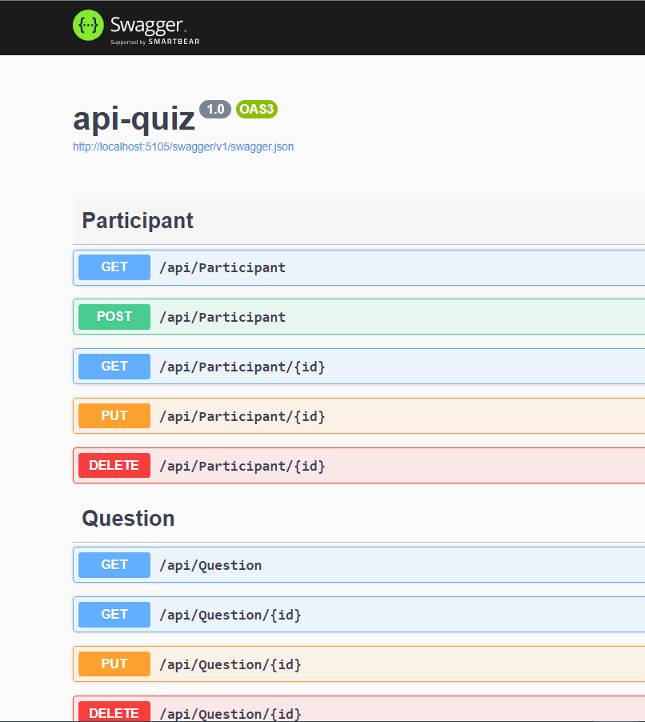
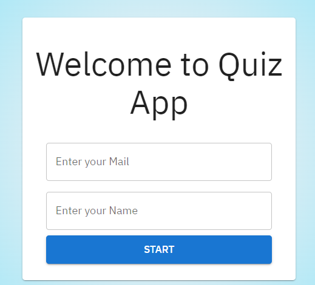
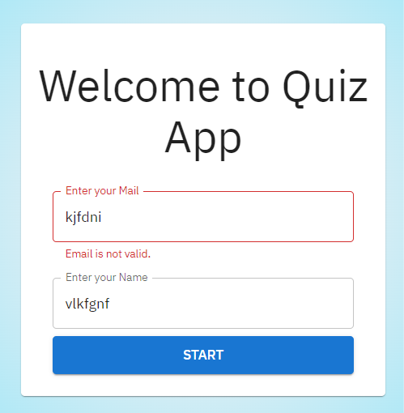
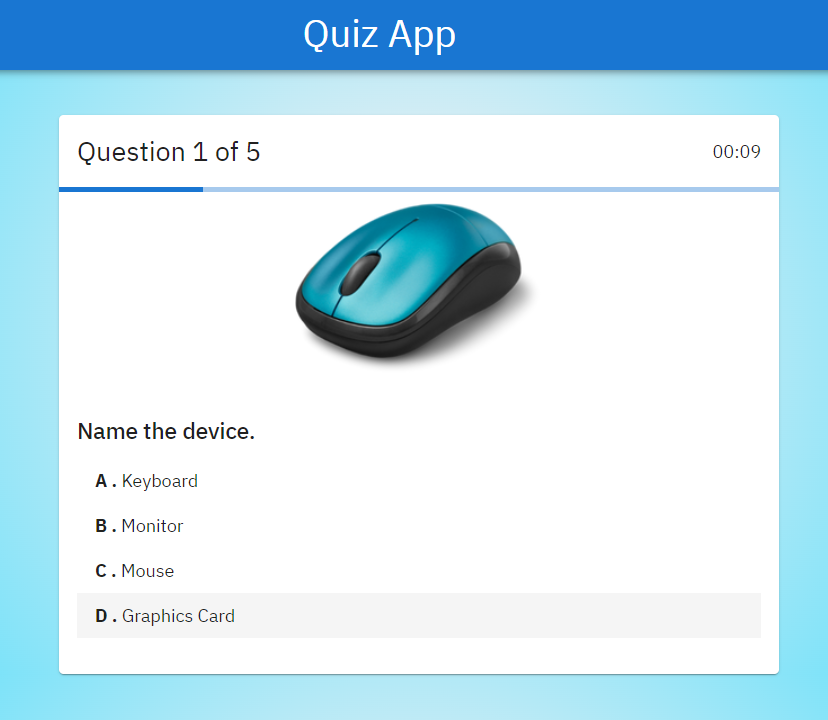
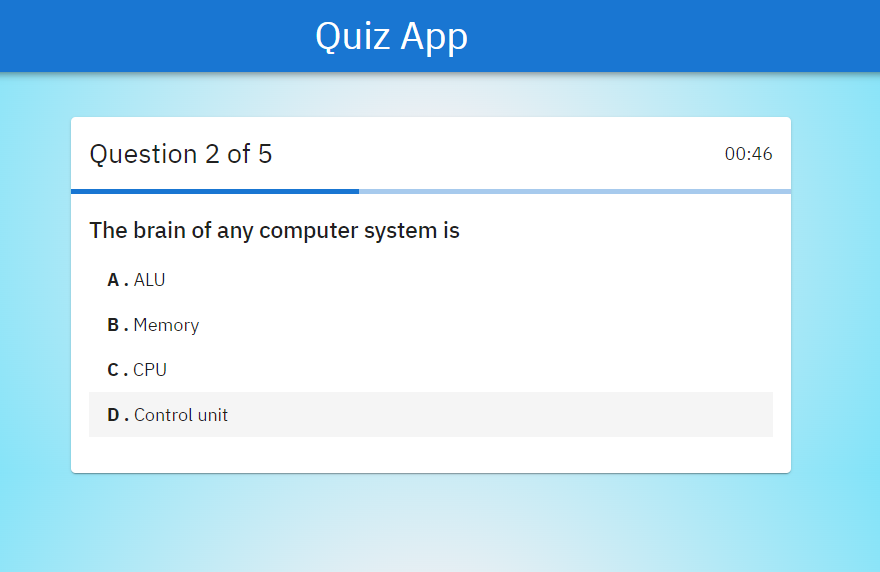
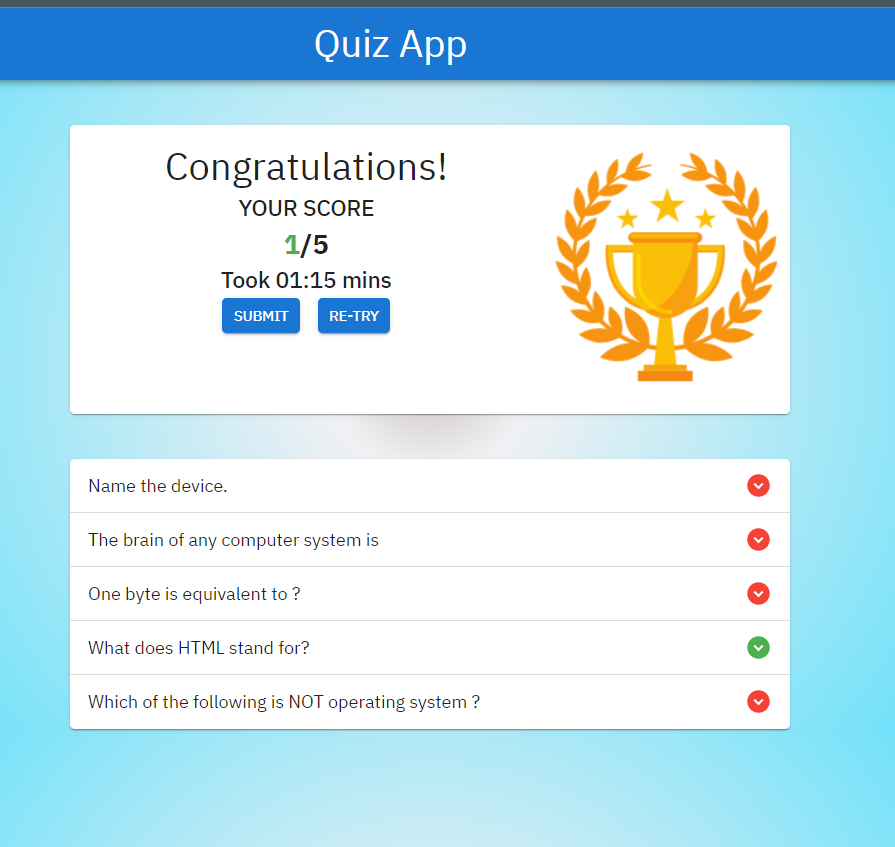
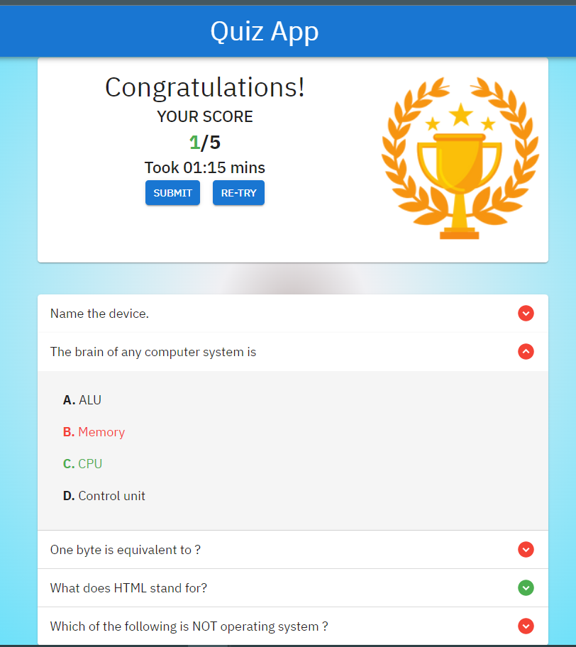

<h1 align="center">Quiz-Appliation-Using-React-DotNet-Core-Api</h1>
</img>
<h2> App Featurs </h2>
<h3> Responsive on all Screens </h3>
<h3>Authentication For Login </h3>

 Validate mail and name if new mail with new name then will add new user to database if not it will append new quiz result to user results list 

</img>

 ------------------------------------------------------------------------------------------------------------

</img>
<h3  > Get random 5 questions From Database </h3>
</img>

 ------------------------------------------------------------------------------------------------------------

</img>
<h3 > Dispaly Results for all Questions and the user answers whether it correct or incorrect & each time taken for each question</h3>
</img>

 ------------------------------------------------------------------------------------------------------------

</img>
<h3 > User Can submit answer to his results list or retake the exam </h3>
</img>
<h2 > Packges and Tools Work With in Backend</h2>

 .NET 6 Wep Api

 SQL Server 

SSMS 2019

 1.Entityframeworkcore

 2.EntityframeworkCore.Tools

 3.EntityframeworkCore.SqlServer

 4.EntityframeworkCore.Design

 5.EntityframeworkCore.CodeGeneration.Design

 6.EntityframeworkCore.Relational
<h2 > Frontend</h2>

React.js

Contextapi

MatrialUI
